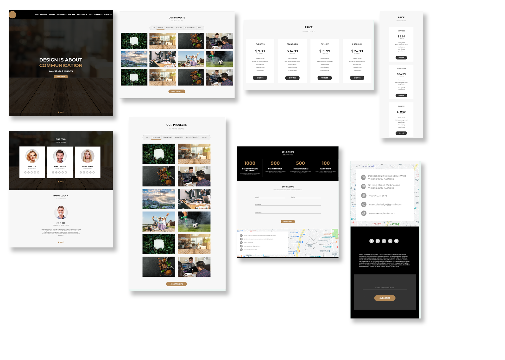

# Projeto Awax - Landing page responsiva

Este é um projeto desenvolvido como parte de um exercício do curso da B7Web focado em **HTML** e **CSS**. O objetivo principal foi aprender sobre a construção de um layout responsivo e as boas práticas no uso dessas tecnologias.

## Descrição

O projeto simula o site de uma empresa fictícia, oferecendo informações sobre os serviços prestados, projetos realizados, e outras seções típicas de um site corporativo. Ele conta com um layout responsivo, que se adapta a diferentes tamanhos de tela, utilizando apenas HTML e CSS.

 

## Funcionalidades

- **Menu de navegação**: Um menu responsivo, que pode ser aberto ou fechado ao clicar no ícone de menu.
- **Banner com slides**: Um banner que alterna entre diferentes imagens e mensagens de chamada à ação.
- **Seções informativas**: Páginas sobre a empresa, seus serviços e projetos realizados.
- **Responsividade**: O design do site se adapta a diferentes dispositivos, oferecendo uma boa experiência tanto em desktops quanto em dispositivos móveis.

## Tecnologias Utilizadas

- **HTML5**: Estrutura básica do conteúdo da página.
- **CSS3**: Estilização do layout, incluindo responsividade e animações simples.
- **Fontes do Google**: Utilização de fontes personalizadas para melhorar a estética do site.
- **JavaScript**: Funcionalidade para abrir e fechar o menu responsivo.

## Como Rodar o Projeto
Projeto pode ser rodado através de https://yvasques.github.io/responsive_design/
